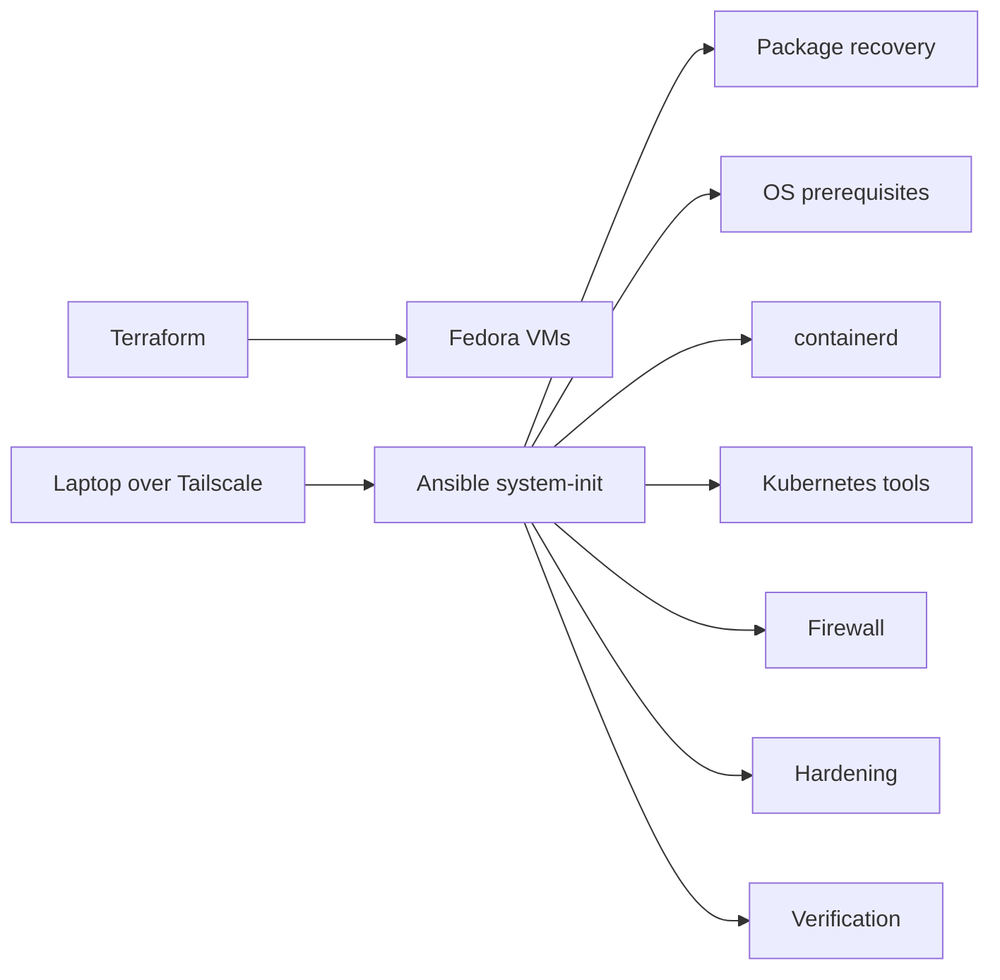

# FILE PATH: docs/ARCHITECTURE.md
# Architecture

Terraform owns VM lifecycle, addressing, compute, and SSH-key injection. Ansible owns guest operating-system state. `playbooks/system-init.yml` is the only node-baseline entry point and composes narrowly scoped roles. Kubernetes bootstrap is intentionally a separate lifecycle phase.

